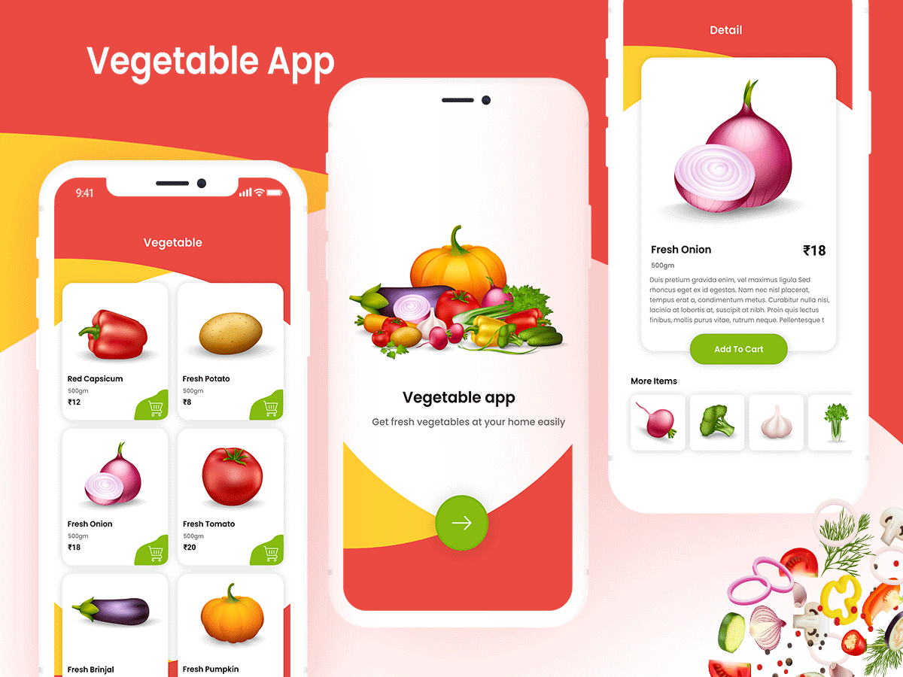
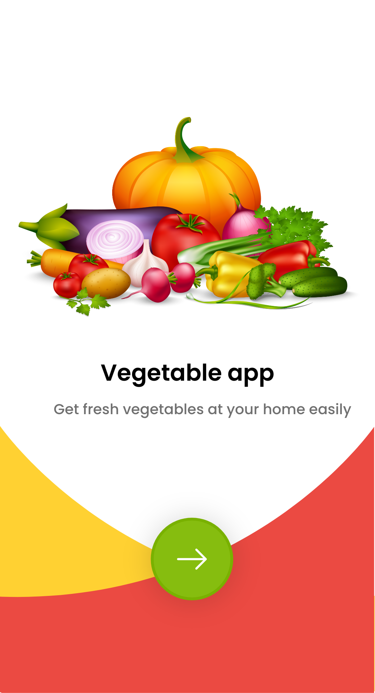

# Flutter Vegetable App

App concept created with android using flutter programming language, inspired by [Flutter Vegetable App.](https://www.uplabs.com/posts/vegetable-app) design found on uplabs.

## About
The app was created to simulate all the system behind the UI kit in the link. There's no code on backend or other web service. The app is all contained in this repository. The models classes was created to better representate an official development, the repositories classes simulate a web request.

## The Inspiration
The images below shows the inspiration concept of the app.

App  Preview
:-------------------------:

The images below shows the home and detail screens of the app.

Splash Screen            |      Home Screen         |  Detail Screen
:-------------------------:|:-------------------------:|:-------------------------:
  |    |  

## Design Details
As exposed on the shared uplab's link, there's all the design details also present in this app.

## Notes
In progress